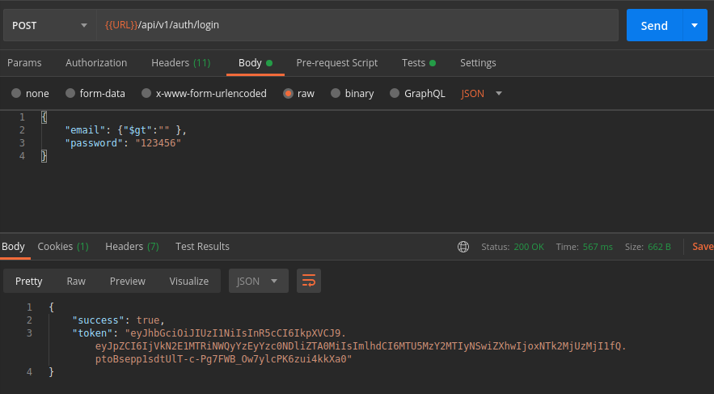
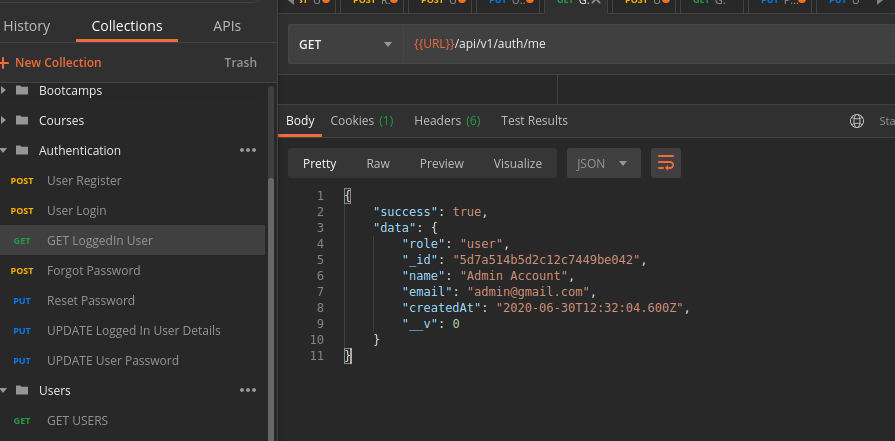
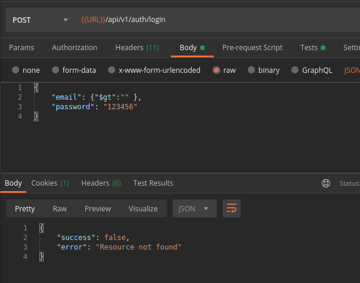
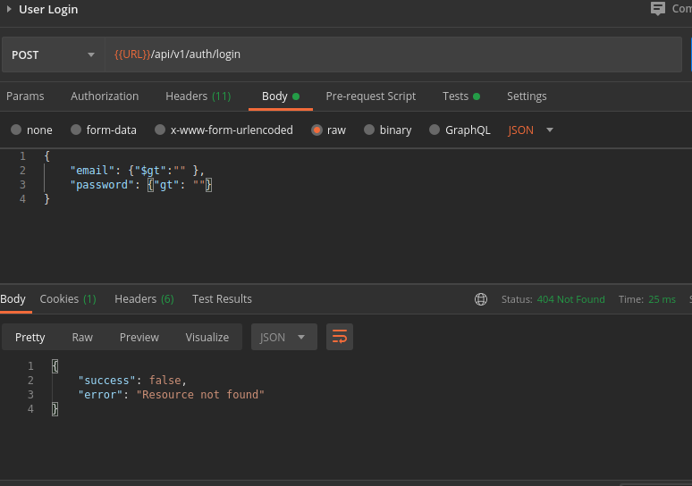

# Prevent NoSql Injection & Sanitize Data

[Hacking Nodejs and mongodb](https://blog.websecurify.com/2014/08/hacking-nodejs-and-mongodb.html)

## Screenshots:

**Screenshot 1: Login to App using fake json document**



- here instead of providing email of the user, we give a json document to login. After successul login ,a token is generated as result

- \$gt selects those documents where the value of the field is greater than (i.e. >) the specified value.

- here v get the first user having a value in the email field.

**Screenshot 2: get the current logged in user**



---

## express-mongo-sanitize

- to bypass this issue we use [express-mongo-santize](https://www.npmjs.com/package/express-mongo-sanitize) package.

```bash
npm i express-mongo-sanitize
```

**server.js**

- add this in server.js file before defining the routes.

```javascript
// To remove data, use:
app.use(mongoSanitize());
// replace prohibited characters with _,
app.use(
  mongoSanitize({
    replaceWith: '_',
  })
);
```

**Screenshot: then try login using api**



**Screenshot 2: using fake json document in both email and password**



- result will be resource not found error.

- here v cant authenticate since v used express-mongo-santize\_ package in **server.js**

---

# XSS Protection ans Security Headers

- using helmet package
- Helmet helps you secure your Express apps by setting various HTTP headers

[Helmet Package](https://helmetjs.github.io/docs/)

[Helmet NPM](https://www.npmjs.com/package/helmet)

```bash
npm i helmet

```

- use helmet in server.js

**server.js**

```javascript
// require helmet
const helmet = require('helmet');

// use this before defining routes

// SET SECURITY HEADERS
app.use(helemt());
```

**Screenshot - send a get request to fetch boocamps**


- you can view new Headers were added to make the app more secure.

---

## Node.Js XSS-Clean

- middleware to sanitize user input coming from POST body, GET queries, and url params

[Nodejs XSS-Clean](https://github.com/jsonmaur/xss-clean)

[xss-clean npm](https://www.npmjs.com/package/xss-clean)

- Why we use this?

**Screenshot**


Here v can view the bootcamp ame field also include some script tag. it might be added accidently by the user, but we have to clean this user sort of bad inputs before saved to database.
So we use xss-clean middleware

#### installation

```bash
npm i xss-clean
```

#### Usage

**server.js**

```javascript
const xssClean = require('xss-clean');
// sanitize user inputs - use the below bfore any routes

app.use(xssClean());
```

- run node server

```bash
npm run dev
```

- Now try adding a bootcamp with name field having some unwanted script tag.

**Screenshot: 1 -send post request**


- Here those script tags will not be saved to our database. it will be marked with &lt operator

---

# Rate Limit, HPP & CORS

## Express rate limit middleware

- Basic rate-limiting middleware for Express. Use to limit repeated requests to public APIs and/or endpoints such as password reset.

[express-rate-limit](https://www.npmjs.com/package/express-rate-limit)

- Installation

```bash
npm i express-rate-limit
```

- Usage

**server.js**

```javascript
const rateLimit = require('express-rate-limit';
// set rate limiter
const limiter = rateLimit({
  windowMs: 15 * 60 * 1000, // 15 minutes
  max: 10, // maximum 1 request in 15 minutes
});
// use before defining route
app.use(limiter);
```

**Screenshot 1: when request exceeds rate limit**


**Screenshot 2: View the Rate limit and remaining rate limit in Header**


---

## HPP

- Express middleware to protect against HTTP Parameter Pollution attacks.

more details on:

[hpp](https://www.npmjs.com/package/hpp)

- Installation

```bash
npm i hpp
```

- Usage

**server.js**

```javascript
const hpp = require('hpp');
// use hpp against HTTP Parameter Pollution attacks
// use before defining route
app.use(hpp());
```

---

## CORS

- Definition

Cross-Origin Resource Sharing (CORS) is a mechanism that uses additional HTTP headers to tell browsers to give a web application running at one origin, access to selected resources from a different origin. A web application executes a cross-origin HTTP request when it requests a resource that has a different origin.

more details on:

[cors](https://www.npmjs.com/package/cors)

- Installation

```bash
npm i cors
```

- Usage

**server.js**

```javascript
const cors = require('cors');

// use before defining routes
app.use(cors());
```

- now we can access resources from other origin from our application.

---
